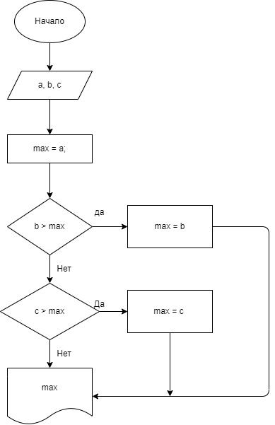

## Homework
- Homework_001 
### Напишите прогамму, которая на вход принимет два числа и выдает, какое число большее, а какое меньшее:
a = 5; b = 7 -> max = 7;

a = 2; b = 10 -> max = 10;

a = -9; b = -3 -> max = -3;

[КОД](Homework_001/Program.cs) 

 - Homework_002
### Hапишите программу, которая принимает на вход три числа и выдаёт максимальное из этих чисел.
2, 3, 7 -> 7

44 5 78 -> 78

22 3 9 -> 22

[КОД](Homework_002/Program.cs)

 - Homework_003
### Напишите программу, которая на вход принимает число и выдаёт, является ли число чётным (делится ли оно на два без остатка):

4 -> да

-3 -> нет

7 -> нет

[КОД](Homework_003/Program.cs)

 - Homework_004